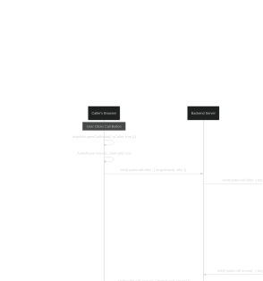
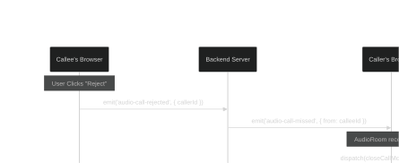
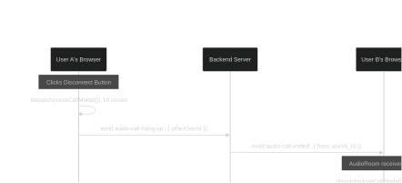

# Real-Time Audio Call Feature (WebRTC)

This document outlines the architecture and implementation of the 1-to-1 real-time audio calling feature in ChatterBox, built using WebRTC and a Socket.io signaling server.

## Overview

The audio call feature allows two users to engage in a direct, peer-to-peer (P2P) audio conversation. WebRTC is used to capture and stream audio directly between the two users' browsers, providing a low-latency and high-quality experience. Our existing Node.js backend serves as a **signaling server** to coordinate the connection setup but does not handle any of the actual audio data, which flows directly between the peers.

## Core Technologies

-   **WebRTC (`RTCPeerConnection`):** The core browser API used to establish the P2P connection. It handles audio encoding/decoding, echo cancellation, and streaming between the two clients.
-   **Socket.io:** Used as the real-time communication layer for our signaling server. It allows us to reliably exchange the metadata required for two peers to find and connect to each other.
-   **React & Redux:** Manages the UI state, user information, and the overall calling flow on the frontend.

## High-Level Architecture: Signaling vs. Media

First, it's crucial to understand that our backend server **does not process any audio**. The audio data flows directly between the two users' browsers in a **Peer-to-Peer (P2P)** connection.

Our backend's only job is to be a **Signaling Server**. It's like a telephone operator who helps two people find each other and connect their lines. Once the connection is made, the operator hangs up, and the conversation is direct.

Here's a simple diagram illustrating this concept:

---

### Key Players: The Code Breakdown

Our system is split between frontend components that handle the UI and WebRTC logic, and backend handlers that manage the signaling.

#### Frontend (`ChatterBox/src/`)

-   **`redux/slices/app.js`**: The single source of truth for the call's state. It holds flags like `call.open`, `call.incomingCallPending`, and the `incomingOffer` data.
-   **`App.jsx`**: The main application component. It contains the crucial global listener for `audio-call-offer`, which allows it to catch a call at any time.
-   **`section/chat/Inbox.jsx`**: Where the user journey begins. The "Call" button in this component dispatches a Redux action to start the process.
-   **`components/IncomingCallDialog.jsx`**: The UI pop-up that shows an incoming call and gives the user the "Accept" and "Reject" options.
-   **`components/AudioRoom.jsx`**: The main call screen. This component contains the core WebRTC logic: creating `RTCPeerConnection`, managing audio streams, and handling the call lifecycle (starting, answering, hanging up).

#### Backend (`chatterbox-backend/`)

-   **`socketServer.js`**: The entry point for all socket communication. It registers all our event handlers for each new connection.
-   **`middleware/authSocket.js`**: Verifies the user's JWT token on connection and attaches their unique `userId` to the socket object. This is **critical** for targeting specific users.
-   **`socketHandlers/newConnectionHandler.js`**: When a user connects, this handler makes their socket join a "room" named after their `userId`. This is how `io.to(userId)` is able to find and send messages to a specific user.
-   **`socketHandlers/audioCallHandler.js`**: Relays the core WebRTC signaling messages (`offer`, `answer`, `ice-candidate`).
-   **`socketHandlers/callRejectedHandler.js`**: Manages the "reject" logic.
-   **`socketHandlers/hangUpHandler.js`**: Manages the "hang up" logic.

---

### The Communication Flow: A Step-by-Step Guide

Let's trace the lifecycle of a call from start to finish.

#### Scenario 1: A Successful Call

This is the main handshake flow where the Caller initiates a call and the Callee accepts.

---

#### Scenario 2: Rejecting a Call

If the Callee doesn't want to answer, the flow is much simpler.

---

#### Scenario 3: Hanging Up a Call

This can be initiated by either user at any time during an active call.

 