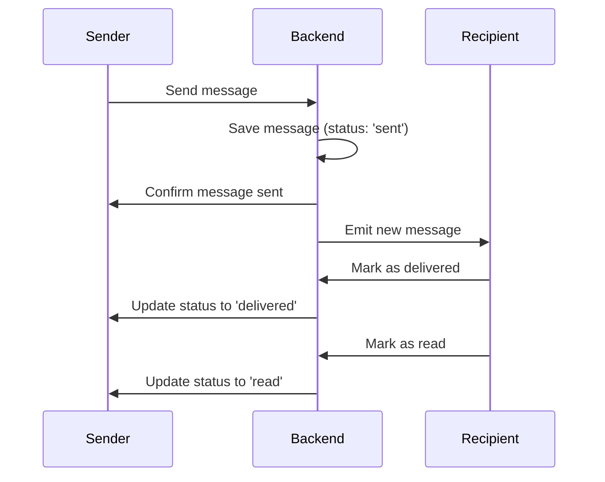

# Read Receipts Implementation

## Overview
The read receipts feature provides real-time status updates for messages in the chat application, showing whether messages have been sent, delivered, or read by recipients. This document outlines the technical implementation and data flow of this feature.

## Technical Architecture

### 1. Data Models

#### Message Model (Backend)
```javascript
{
  _id: ObjectId,
  conversation: ObjectId,
  author: ObjectId,
  content: String,
  type: String,
  status: {
    type: String,
    enum: ['sent', 'delivered', 'read'],
    default: 'sent'
  },
  readBy: [{
    user: ObjectId,
    timestamp: Date
  }]
}
```

### 2. Socket Events

#### Backend Events
- `message:status`: Updates message status (sent → delivered → read)
- `message:delivered`: Marks message as delivered
- `message:read`: Marks message as read

#### Frontend Events
- `markMessageAsDelivered`: Emits when message is delivered
- `markMessageAsRead`: Emits when message is read
- `messageStatusUpdate`: Listens for status updates

### 3. Redux State Management

```javascript
{
  messageStatus: {
    [messageId]: {
      status: 'sent' | 'delivered' | 'read',
      timestamp: Date
    }
  }
}
```

## Data Flow

### 1. Message Sending Flow


### 2. Status Update Flow

#### Delivered Status
1. Recipient receives message via socket
2. `handleNewMessage` in SocketContext processes message
3. If message is from another user and in current conversation:
   - Message is marked as delivered
   - Socket emits `markMessageAsDelivered`
   - Backend updates message status
   - Status update is broadcast to all participants

#### Read Status
1. Message is marked as read when:
   - User opens conversation with unread messages
   - New message arrives while conversation is open
2. `markConversationAsRead` processes unread messages
3. Socket emits `markMessageAsRead` for each message
4. Backend updates message status and readBy array
5. Status update is broadcast to all participants

### 3. UI Updates
- Message components (Text, Media, Document, Voice) display status indicators
- Status icons update in real-time based on Redux state
- Visual indicators:
  - Single tick (✓): Sent
  - Double tick gray (✓✓): Delivered
  - Double tick blue (✓✓): Read

## Implementation Details

### 1. Socket Handlers

#### Backend (`messageStatusHandler.js`)
```javascript
const messageStatusHandler = async (socket, data) => {
  const { messageId, conversationId, status } = data;
  
  // Update message status
  const message = await Message.findById(messageId);
  message.status = status;
  
  // If marking as read, update readBy array
  if (status === 'read') {
    message.readBy.push({
      user: socket.user._id,
      timestamp: new Date()
    });
  }
  
  await message.save();
  
  // Broadcast status update
  socket.to(conversationId).emit('messageStatusUpdate', {
    messageId,
    status
  });
};
```

#### Frontend (`SocketContext.jsx`)
```javascript
const markMessageAsRead = (messageId, conversationId) => {
  socket.emit('markMessageAsRead', { messageId, conversationId });
};

const markMessageAsDelivered = (messageId, conversationId) => {
  socket.emit('markMessageAsDelivered', { messageId, conversationId });
};
```

### 2. Redux Integration

#### Actions
```javascript
export const SetMessageStatus = (messageId, status) => {
  return (dispatch) => {
    dispatch(slice.actions.SetMessageStatus({ messageId, status }));
  };
};
```

#### Reducers
```javascript
SetMessageStatus: (state, action) => {
  const { messageId, status } = action.payload;
  state.messageStatus[messageId] = {
    status,
    timestamp: new Date()
  };
}
```

## Error Handling

1. **Socket Disconnection**
   - Status updates are queued
   - Updates are processed when connection is restored

2. **Failed Status Updates**
   - Retry mechanism for failed status updates
   - Fallback to last known status

3. **Race Conditions**
   - Delays between status updates (500ms)
   - Status progression enforcement (sent → delivered → read)

## Performance Considerations

1. **Optimization**
   - Batch status updates for multiple messages
   - Debounced status updates
   - Efficient Redux state updates

2. **Memory Management**
   - Cleanup of old message statuses
   - Limited status history retention

## Testing

1. **Unit Tests**
   - Socket event handling
   - Redux state updates
   - Status progression logic

2. **Integration Tests**
   - End-to-end message flow
   - Real-time status updates
   - Multiple user scenarios

3. **Edge Cases**
   - Offline/online transitions
   - Multiple devices
   - High message volume

## Dependencies

- Socket.IO: Real-time communication
- Redux: State management
- MongoDB: Message storage
- React: UI components

## Future Improvements

1. **Enhanced Features**
   - Typing indicators
   - Message reactions
   - Message editing

2. **Performance**
   - WebSocket compression
   - Optimistic updates
   - Caching strategies

3. **User Experience**
   - Custom status indicators
   - Status preferences
   - Read time tracking 