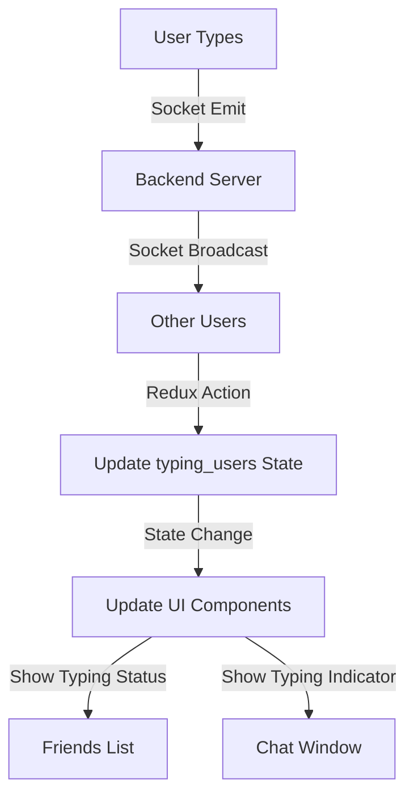

# Typing Indicator Feature Documentation

## Overview
This document explains how the typing indicator works in our chat application. The feature shows "Typing..." status when someone is typing a message, similar to WhatsApp or Facebook Messenger.

## Where You Can See Typing Status
1. In the chat window when someone is actively typing
2. In the friends list (shows which friend is currently typing)

## How It Works (Simple Explanation)

1. **When Someone Starts Typing:**
   - As soon as your friend starts typing, their status changes to "Typing..."
   - The text pulses with animation to catch attention
   - Works even if you're not in their chat window

2. **When Someone Stops Typing:**
   - After 2 seconds of no typing, the status goes back to normal
   - Shows their regular status (Online/Offline)

## Technical Implementation

### 1. Socket Events
We use Socket.IO for real-time communication between users:

```javascript
// When user starts typing
socket.emit('start-typing', { 
  userId,           // ID of the person receiving the message
  conversationId    // Which chat this is happening in
});

// When user stops typing
socket.emit('stop-typing', { 
  userId,
  conversationId
});
```

### 2. Redux State Management
We store typing status in Redux:

```javascript
// Initial state in app slice
const initialState = {
  // ... other state
  typing_users: {}, // Format: { conversationId: { userId: true } }
};

// Reducer to handle typing status
setTyping(state, action) {
  const { conversationId, userId, isTyping } = action.payload;

  // Create typing_users object if it doesn't exist
  if (!state.typing_users) {
    state.typing_users = {};
  }

  if (!state.typing_users[conversationId]) {
    state.typing_users[conversationId] = {};
  }

  if (isTyping) {
    state.typing_users[conversationId][userId] = true;
  } else {
    delete state.typing_users[conversationId][userId];
  }
}
```

### 3. Socket Event Handlers (SocketContext.jsx)
```javascript
// Handle typing events in socket context
socket.on('start-typing', (data) => {
  if (data.conversationId && data.typingUserId) {
    dispatch(SetTyping(data.conversationId, data.typingUserId, true));
  }
});

socket.on('stop-typing', (data) => {
  if (data.conversationId && data.typingUserId) {
    dispatch(SetTyping(data.conversationId, data.typingUserId, false));
  }
});
```

### 4. Chat Tab Component (ChatTab.jsx)
This component shows the typing status in the friends list:

```javascript
const ChatTab = ({ user, isFriend = false }) => {
  // Get typing status from Redux
  const typing_users = useSelector((store) => store?.app?.typing_users);
  
  // Check if this user is typing in any conversation
  const isTyping = Object.entries(typing_users || {}).some(([conversationId, users]) => {
    return users && users[userId];
  });

  return (
    // ... other JSX
    <p className={`text-sm ${isTyping ? "text-primary animate-pulse" : "text-gray-5"}`}>
      {isTyping ? "Typing..." : userStatus}
    </p>
    // ... other JSX
  );
};
```

#### Deep Dive: Understanding the Typing Check Logic

Let's break down the typing check code step by step:

```javascript
const isTyping = Object.entries(typing_users || {}).some(([conversationId, users]) => {
  return users && users[userId];
});
```

1. **Data Structure:**
   ```javascript
   // Example of typing_users object structure:
   typing_users = {
     "conversation123": {
       "user456": true,
       "user789": true
     },
     "conversation456": {
       "user123": true
     }
   }
   ```

2. **Code Breakdown:**
   ```javascript
   // Fallback to empty object if typing_users is null/undefined
   typing_users || {}
   
   // Convert object to array of [key, value] pairs
   Object.entries(typing_users || {})
   /* Results in:
   [
     ["conversation123", { "user456": true, "user789": true }],
     ["conversation456", { "user123": true }]
   ]
   */
   
   // Destructure each entry into conversationId and users
   ([conversationId, users]) => {
     // users is the object containing typing users for this conversation
     // Example: { "user456": true, "user789": true }
   }
   
   // Check if this specific user is typing
   users && users[userId]
   // users && -> Safety check to prevent errors if users is undefined
   // users[userId] -> true if this user is typing, undefined if not
   ```

3. **The `.some()` Method:**
   - `.some()` checks if at least one item in the array meets a condition
   - Returns `true` if the user is typing in ANY conversation
   - Returns `false` if the user is not typing in ANY conversation

4. **Example Scenarios:**
   ```javascript
   // Example 1: User is typing in one conversation
   typing_users = {
     "conv1": { "user123": true },
     "conv2": { "user456": true }
   }
   userId = "user123"
   // isTyping will be true because user123 is typing in conv1

   // Example 2: User is not typing anywhere
   typing_users = {
     "conv1": { "user456": true },
     "conv2": { "user789": true }
   }
   userId = "user123"
   // isTyping will be false because user123 is not typing in any conversation
   ```

5. **Safety Features:**
   - `typing_users || {}` - Provides an empty object if typing_users is null
   - `users && users[userId]` - Prevents errors if users object is undefined
   - Works even if the typing_users object is empty or malformed

This code efficiently checks all conversations at once to see if a user is typing anywhere in the application, making it perfect for showing typing status in a friends list.

## Styling
We use Tailwind CSS for the typing indicator:

```javascript
// Normal status
"text-sm text-gray-5 dark:text-gray-4"

// Typing status
"text-sm text-primary animate-pulse"
```

## Data Flow



## Implementation Steps

1. **Backend Setup:**
   - Socket event handlers for 'start-typing' and 'stop-typing'
   - Broadcasting typing status to relevant users

2. **Frontend Redux:**
   - Store for typing status
   - Actions and reducers for updating typing state

3. **UI Components:**
   - ChatTab component for friends list
   - Typing indicator in chat window
   - Styling and animations

## Best Practices Used

1. **Debouncing:**
   - Wait 2 seconds of no typing before sending 'stop-typing'
   - Prevents too many socket events

2. **State Management:**
   - Centralized Redux store for typing status
   - Clean state updates with proper immutability

3. **Performance:**
   - Efficient checks for typing status
   - Minimal re-renders with proper state structure

4. **User Experience:**
   - Visual feedback with animations
   - Real-time updates across all components

## Common Issues and Solutions

1. **Typing Status Stuck:**
   - Automatically clear typing status after timeout
   - Handle disconnections properly

2. **Multiple Typing Indicators:**
   - Use unique conversation IDs
   - Clear old typing states on conversation switch

3. **Performance Issues:**
   - Use proper cleanup in useEffect
   - Optimize Redux selectors

## Testing

To test the typing indicator:

1. Open two browser windows
2. Log in with different accounts
3. Start typing in one window
4. Verify typing status appears in:
   - Other user's friends list
   - Other user's chat window
5. Stop typing and verify status clears 